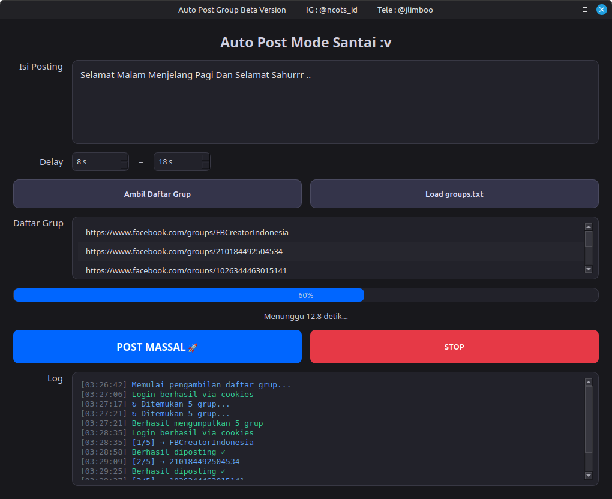
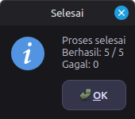
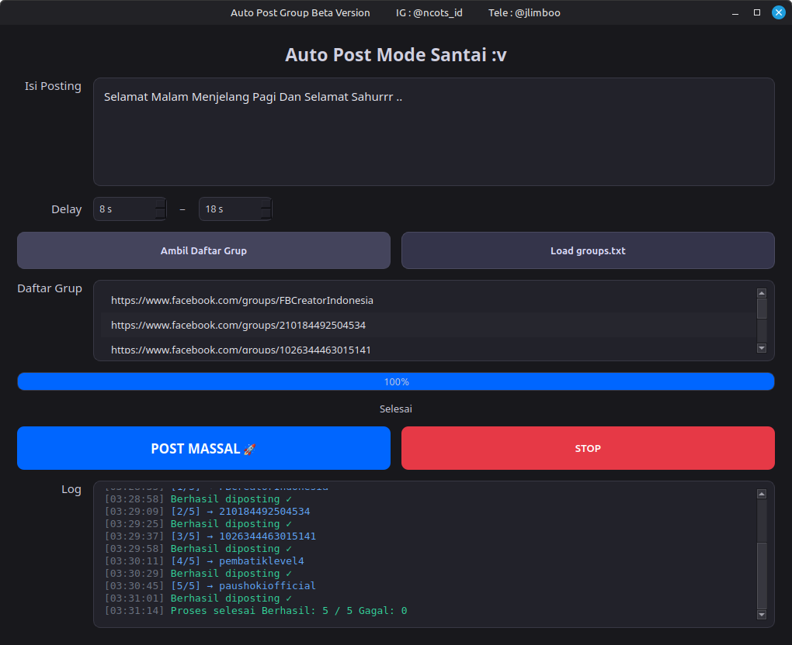

# Auto-Post-Group-Facebook
Auto Posting Ke Banyak Group Facebook

<p align="center">
  
  <br>
  
  <br>
  
  <br>
  <em>Tampilan Sample</em>
</p>

- TIDAK SEMUA GROUP BISA DI POSTING. Kadang status sukses tetapi posting tidak benar-benar terbit. Penyebab umum: grup dikunci/diarsipkan, butuh persetujuan admin, atau UI/XPATH Facebook berubah.

**Note**
- Saya tes bukan pakai akun biasa, tapi pakai fanspage untuk mengurangi risiko akun utama.
- Harap jangan gunakan akun utama/pribadi. Gunakan akun uji (tuyul) atau fanspage kecil untuk menghindari checkpoint/banned dari Meta.

**Fitur utama**
- Login pakai cookies (tanpa email/password)
- Ambil daftar grup yang diikuti secara otomatis
- Posting teks dengan delay random (mode santai anti-deteksi)
- Simpan daftar grup ke `groups.txt`
- Dark theme + log real-time

**Peringatan penting**
Penggunaan otomatisasi di Facebook melanggar Terms of Service. Gunakan dengan risiko sendiri. Tidak bertanggung jawab atas banned akun.

**Cara pakai singkat**
1. Install dependensi: `pip install -r requirements.txt`
2. Simpan cookies Facebook ke `cookies.json`
3. Jalankan: `python main.py`
4. Klik "Ambil Daftar Grup" atau load dari `groups.txt`
5. Tulis teks lalu klik tombol **POST MASSAL**

**Cara Ambil Cookies**
1. Install extension cookie-editor.
2. Buka cookie-editor di halaman beranda Facebook lalu export dalam format JSON.
3. Paste ke file `cookies.json` dengan format list objek cookie (contoh minimal):

```json
[
  {
    "name": "c_user",
    "value": "ISI_NILAI_COOKIE",
    "domain": ".facebook.com",
    "path": "/"
  },
  {
    "name": "xs",
    "value": "ISI_NILAI_COOKIE",
    "domain": ".facebook.com",
    "path": "/"
  }
]
```

4. Simpan lalu jalankan tools.

**Requirements**
Python 3.9+

**Cara Menjalankan di Windows**
- Opsi paling gampang: klik dua kali `start.bat`
- Dari PowerShell tanpa aktivasi venv: `.\.venv\Scripts\python.exe main.py`
- Jika ingin pakai script PowerShell: `powershell -ExecutionPolicy Bypass -File .\start.ps1`
